# Sistema de Inscripciones 


## 📋 Descripción

Este proyecto es un **Sistema de Gestión de Inscripciones** desarrollado en Java que permite administrar estudiantes, cursos y sus inscripciones. Ha sido diseñado como proyecto de cierre para demostrar el uso de **excepciones personalizadas**, **logging** y **pruebas unitarias** en Java.

## 🎯 Objetivo Didáctico

Este proyecto demuestra las siguientes competencias:

### 1. Excepciones Personalizadas
Implementación de excepciones específicas para el dominio del negocio:
- `CursoLlenoException`: Cuando un curso alcanza su capacidad máxima
- `EstudianteNoEncontradoException`: Cuando no se encuentra un estudiante
- `CursoNoEncontradoException`: Cuando no se encuentra un curso
- `CursoDuplicadoException`: Cuando se intenta crear un curso con código existente
- `EstudianteDuplicadoException`: Cuando un estudiante ya está inscrito en un curso

### 2. Logging con Log4j2
Registro completo de operaciones mediante Apache Log4j2:
- Logs de inicialización de servicios
- Logs de operaciones CRUD
- Logs de advertencias (warnings)
- Logs de errores
- Configuración mediante archivo XML

### 3. Pruebas Unitarias con JUnit 5
Cobertura de pruebas para todos los casos de uso:
- Tests de casos exitosos
- Tests de excepciones
- Tests de edge cases (null, duplicados, listas vacías)
- Uso de `@BeforeEach` para configuración
- Uso de `assertEquals` para verificación de retornos correctos
- Uso de `assertThrows` para verificación de excepciones

## 🏗️ Diagrama de Clases

```plantuml
@startuml
!theme plain
skinparam defaultFontName Arial
skinparam defaultFontSize 10
skinparam classAttributeIconSize 0
skinparam packageStyle rectangle
skinparam nodesep 40
skinparam ranksep 60
skinparam linetype ortho

' Configuración de colores por package
skinparam package {
    BackgroundColor<<model>> #E8F5E9
    BorderColor<<model>> #388E3C
    BackgroundColor<<service>> #E3F2FD
    BorderColor<<service>> #1976D2
    BackgroundColor<<exception>> #FFEBEE
    BorderColor<<exception>> #C62828
    BackgroundColor<<test>> #FFF9C4
    BorderColor<<test>> #F9A825
}

skinparam class {
    BackgroundColor<<model>> #C8E6C9
    BorderColor<<model>> #388E3C
    BackgroundColor<<service>> #90CAF9
    BorderColor<<service>> #1976D2
    BackgroundColor<<exception>> #FFCDD2
    BorderColor<<exception>> #C62828
    BackgroundColor<<test>> #FFF59D
    BorderColor<<test>> #F9A825
    BackgroundColor<<main>> #E1BEE7
    BorderColor<<main>> #7B1FA2
    BackgroundColor<<base>> #F5F5F5
    BorderColor<<base>> #757575
    ArrowColor Black
}

title <size:16><b>Diagrama de Clases - Sistema de Inscripciones</b></size>

' ==================== NIVEL 1: MAIN ====================
class Main <<main>> {
    - logger: Logger
    - scanner: Scanner
    - cursoService: CursoService
    - inscripcionService: InscripcionService
    - estudiantes: List<Estudiante>
    --
    + main(String[]): void
    + mostrarMenu(): void
    + leerOpcion(): int
    + crearEstudiante(): void
    + crearCurso(): void
    + agregarEstudianteACurso(): void
    + listarCursosPorEstudiante(): void
    + listarEstudiantesDeCurso(): void
    + eliminarEstudianteDeCurso(): void
}

note right of Main
  <b>Punto de Entrada</b>
  Interfaz de usuario
  y menú principal
end note

' ==================== NIVEL 2: SERVICIOS ====================
package "service" <<service>> {
    class CursoService <<service>> {
        - logger: Logger
        - cursos: List<Curso>
        --
        + CursoService()
        + agregarCurso(Curso): void
        + getCursos(): List<Curso>
        + getCursoPorId(String): Curso
    }
    
    class InscripcionService <<service>> {
        - logger: Logger
        - inscripciones: List<Inscripcion>
        --
        + InscripcionService()
        + cursoLleno(Curso): boolean
        + agregarEstudiante(Curso, Estudiante, LocalDate): void
        + eliminarEstudiante(Curso, Estudiante): void
        + ListarInscripcionesPorEstudiante(Estudiante): List<Inscripcion>
    }
}

note top of service
  <b>Capa de Servicios</b>
  Lógica de negocio y gestión
end note

' ==================== NIVEL 3: MODELO ====================
package "model" <<model>> {
    class Estudiante <<model>> {
        - nombre: String
        - id: String
        - email: String
        --
        + Estudiante(String, String, String)
        + getNombre(): String
        + setNombre(String): void
        + getId(): String
        + getEmail(): String
        + setEmail(String): void
        + toString(): String
    }
    
    class Inscripcion <<model>> {
        - curso: Curso
        - estudiante: Estudiante
        - fechaInscripcion: LocalDate
        --
        + Inscripcion(Curso, Estudiante, LocalDate)
        + getCurso(): Curso
        + getEstudiante(): Estudiante
        + getFechaInscripcion(): LocalDate
        + toString(): String
    }
    
    class Curso <<model>> {
        - nombre: String
        - codigo: String
        - capacidad: int
        - inscripciones: List<Inscripcion>
        --
        + Curso(String, String, int)
        + getNombre(): String
        + setNombre(String): void
        + setCapacidad(int): void
        + getCodigo(): String
        + getCapacidad(): int
        + getInscripciones(): List<Inscripcion>
        + agregarInscripcion(Inscripcion): void
        + toString(): String
    }
}

note top of model
  <b>Modelo de Dominio</b>
  Entidades principales del negocio
end note

' ==================== NIVEL 4: EXCEPCIONES Y CLASES BASE ====================
together {
    class Exception <<base>> {
    }
    
    class RuntimeException <<base>> {
    }
}

package "exception" <<exception>> {
    together {
        class EstudianteNoEncontradoException <<exception>> {
            + EstudianteNoEncontradoException(String)
        }
    }
    
    together {
        class CursoNoEncontradoException <<exception>> {
            + CursoNoEncontradoException(String)
        }
        
        class CursoDuplicadoException <<exception>> {
            + CursoDuplicadoException(String)
        }
        
        class CursoLlenoException <<exception>> {
            + CursoLlenoException(String)
        }
        
        class EstudianteDuplicadoException <<exception>> {
            + EstudianteDuplicadoException(String)
        }
    }
}

note bottom of exception
  <b>Excepciones Personalizadas</b>
  Control de errores del sistema
end note

' ==================== NIVEL 5: TESTS ====================
package "test" <<test>> {
    class CursoServiceTest <<test>> {
        - cursoService: CursoService
        --
        + setUp(): void
        + agregarCursoCorrectamente(): void
        + listarCursoVacio(): void
        + buscarCursoPorIdExistente(): void
        + buscarCursoPorIdInexistente(): void
        + agregarCursoNull(): void
        + agregarCursoDuplicado(): void
    }
    
    class InscripcionServiceTest <<test>> {
        - inscripcionService: InscripcionService
        --
        + setUp(): void
        + agregarInscripcionCorrectamente(): void
        + agregarInscripcionCursoLleno(): void
        + eliminarInscripcion(): void
        + eliminarInscripcionNoExistente(): void
        + listarInscripcionesPorEstudiante(): void
        + agregarEstudianteNull(): void
        + agregarCursoNull(): void
        + agregarFechaNull(): void
        + agregarEstudianteDuplicado(): void
        + eliminarDeListaVacia(): void
    }
}

note top of test
  <b>Pruebas Unitarias</b>
  Validación de servicios
end note

' ==================== ORDEN VERTICAL ====================
Main -[hidden]down-> service
service -[hidden]down-> model
model -[hidden]down-> exception
exception -[hidden]down-> test

' Orden horizontal dentro de packages
CursoService -[hidden]right-> InscripcionService
Estudiante -[hidden]right-> Inscripcion
Inscripcion -[hidden]right-> Curso
CursoServiceTest -[hidden]right-> InscripcionServiceTest

' ==================== RELACIONES MAIN -> SERVICIOS ====================
Main -down-> CursoService : usa
Main -down-> InscripcionService : usa

' ==================== RELACIONES MAIN -> MODELO ====================
Main ..> Estudiante : usa
Main ..> Curso : usa
Main ..> Inscripcion : usa

' ==================== RELACIONES SERVICIOS -> MODELO ====================
CursoService -down-> Curso : gestiona
InscripcionService -down-> Inscripcion : gestiona

' ==================== RELACIONES DEL MODELO ====================
Estudiante "1" -- "*" Inscripcion : tiene
Curso "1" -- "*" Inscripcion : contiene

' ==================== HERENCIA DE EXCEPCIONES ====================
EstudianteNoEncontradoException -down-|> Exception
CursoNoEncontradoException -down-|> RuntimeException
CursoDuplicadoException -down-|> RuntimeException
CursoLlenoException -down-|> RuntimeException
EstudianteDuplicadoException -up-|> RuntimeException

' ==================== EXCEPCIONES LANZADAS ====================
CursoService ..> CursoDuplicadoException : lanza
CursoService ..> CursoNoEncontradoException : lanza
InscripcionService ..> CursoLlenoException : lanza
InscripcionService ..> EstudianteNoEncontradoException : lanza
InscripcionService ..> EstudianteDuplicadoException : lanza

' ==================== TESTS -> SERVICIOS ====================
CursoServiceTest -up-> CursoService : prueba
InscripcionServiceTest -up-> InscripcionService : prueba

@enduml
```



## 📁 Estructura del Proyecto

```
proyectodecierre/
├── pom.xml
├── src/
│   ├── main/
│   │   ├── java/
│   │   │   └── com/devsenior/manuel/
│   │   │       ├── Main.java
│   │   │       ├── model/
│   │   │       │   ├── Estudiante.java
│   │   │       │   ├── Curso.java
│   │   │       │   └── Inscripcion.java
│   │   │       ├── service/
│   │   │       │   ├── CursoService.java
│   │   │       │   └── InscripcionService.java
│   │   │       └── exception/
│   │   │           ├── CursoLlenoException.java
│   │   │           ├── EstudianteNoEncontradoException.java
│   │   │           ├── CursoNoEncontradoException.java
│   │   │           ├── CursoDuplicadoException.java
│   │   │           └── EstudianteDuplicadoException.java
│   │   └── resources/
│   │       └── log4j2.xml
│   └── test/
│       └── java/
│           └── com/devsenior/manuel/
│               ├── CursoServiceTest.java
│               └── InscripcionServiceTest.java
└── target/
```

## 🚀 Cómo Ejecutar

### Prerrequisitos
- Java 17 o superior
- Maven 3.8 o superior

### Compilar el proyecto

```bash
cd proyectodecierre
mvn clean compile
```

### Ejecutar la aplicación

```bash
mvn exec:java -Dexec.mainClass="com.devsenior.manuel.Main"
```

O compilar y ejecutar el JAR:

```bash
mvn clean package
java -jar target/proyectodecierre-1.0-SNAPSHOT.jar
```

### Ejecutar pruebas unitarias

```bash
mvn test
```

Para ver el reporte detallado de pruebas:

```bash
mvn test -Dtest=CursoServiceTest,InscripcionServiceTest
```

## 📱 Menú Interactivo

La aplicación presenta un menú interactivo en consola:

```
╔════════════════════════════════════╗
║         MENÚ PRINCIPAL             ║
╠════════════════════════════════════╣
║ 1. Crear Estudiante                ║
║ 2. Crear Curso                     ║
║ 3. Agregar Estudiante a Curso      ║
║ 4. Listar Cursos por Estudiante    ║
║ 5. Listar Estudiantes de un Curso  ║
║ 6. Eliminar Estudiante de Curso    ║
║ 7. Salir                           ║
╚════════════════════════════════════╝
```

### Flujo de uso típico:

1. **Crear Estudiante**: Ingresar nombre, ID y email
2. **Crear Curso**: Ingresar nombre, código y capacidad
3. **Agregar a Curso**: Seleccionar estudiante y curso, opcionalmente especificar fecha
4. **Listar por Estudiante**: Ver todos los cursos de un estudiante
5. **Listar de Curso**: Ver todos los estudiantes inscritos
6. **Eliminar**: Remover inscripción con confirmación

## 🛡️ Validaciones Implementadas

### Validaciones de Negocio
- ✅ No se puede inscribir estudiante en curso lleno
- ✅ No se puede inscribir el mismo estudiante dos veces al mismo curso
- ✅ No se pueden crear cursos con código duplicado
- ✅ No se pueden crear estudiantes con ID duplicado
- ✅ Validación de capacidad mayor a 0

### Validaciones de Edge Cases
- ✅ Parámetros null en todos los métodos
- ✅ Listas vacías (eliminar de lista vacía)
- ✅ IDs inexistentes
- ✅ Cursos sin inscripciones
- ✅ Formato de fechas inválido

## 🧪 Pruebas Unitarias

El proyecto cuenta con **16 tests** que cubren:

### CursoServiceTest (6 tests)
- Crear curso correctamente
- Listar cursos vacío
- Buscar curso por ID existente
- Buscar curso por ID inexistente
- Agregar curso null
- Agregar curso duplicado

### InscripcionServiceTest (10 tests)
- Agregar inscripción correctamente
- Agregar a curso lleno
- Eliminar inscripción
- Eliminar inscripción no existente
- Listar inscripciones por estudiante
- Agregar estudiante null
- Agregar curso null
- Agregar fecha null
- Agregar estudiante duplicado
- Eliminar de lista vacía

## 📝 Logs

Los logs se generan en la carpeta `logs/` con el siguiente formato:

```
2024-02-08 17:22:15 [main] INFO  com.devsenior.manuel.Main - Application started
2024-02-08 17:22:15 [main] INFO  c.d.m.service.CursoService - CursoService initialized
2024-02-08 17:22:15 [main] INFO  c.d.m.s.InscripcionService - InscripcionService initialized
```

## 🛠️ Tecnologías Utilizadas

- **Java 17**: Lenguaje de programación
- **Maven**: Gestión de dependencias y build
- **JUnit 5**: Framework de pruebas unitarias
- **Log4j2**: Framework de logging
- **PlantUML**: Generación de diagramas de clases

## 📄 Licencia

Este proyecto es de uso educativo para el curso de Java Senior AI.

## 👨‍💻 Autor

**Manuel** - *Proyecto de Cierre - Módulo 1, Unidad 3*

---

⭐ **Nota**: Este proyecto demuestra buenas prácticas de programación orientada a objetos, manejo de excepciones, logging estructurado y pruebas unitarias exhaustivas en Java.
